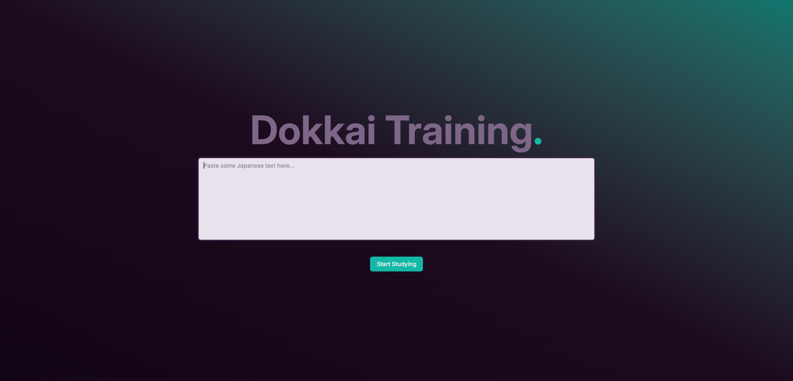
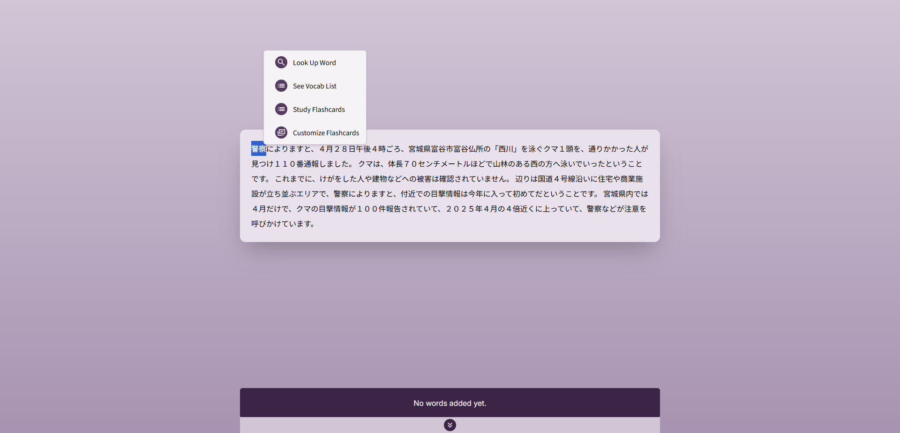
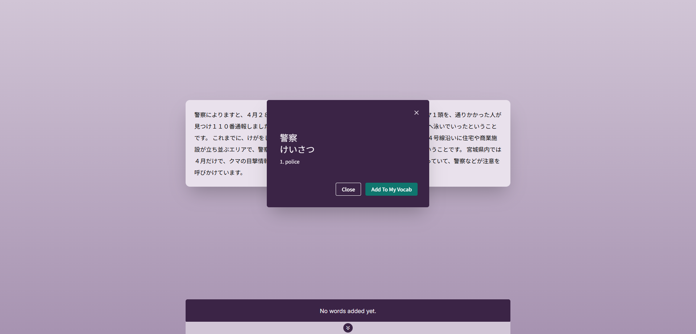
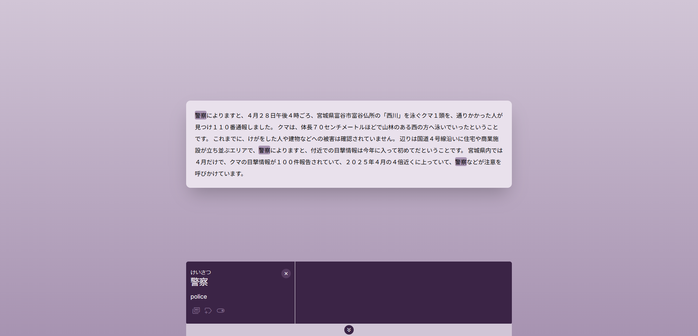
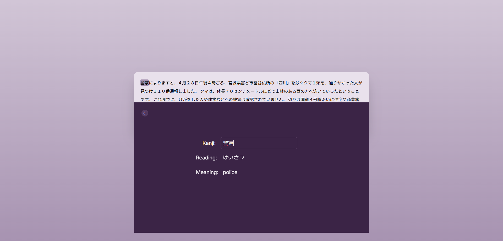

# Dokkai Training

A React + TypeScript application for improving Japanese reading comprehension and vocabulary through interactive text, highlighting, and flashcard-based study.

---

## Screenshots












## Features

- Paste and interact with text for reading practice
- Highlight words directly in the text
- Save selected vocabulary items
- Create custom flashcard stacks
- Study using a flashcard system
- Filter vocabulary by tags
- Automatically save sessions using local storage
- Look up word definitions via API

---

## Tech Stack

- React 19
- TypeScript
- Vite
- Tailwind CSS
- Axios (API requests)
- Express (backend support)

---

## Installation

```bash
git clone https://github.com/yourname/dokkai-training.git
cd dokkai-training
npm install
npm run dev
```

## Usage

- Start a new session
- Paste text into the app
- Highlight words while reading
- Add words to your vocabulary list
- Create a flashcard stack
- Study using flashcards

---

## Core Functionality (Custom Hooks)

- usePastedText → manages input text and session data
- useHighlight → handles word highlighting logic
- useVocabList → manages saved vocabulary
- useFlashCard → controls flashcard behavior
- useHandleFlashcardStackCreation → builds study stacks
- useTagSelection → filters vocabulary by tags
- useWordLookUp → fetches definitions
- useLocalStorage → persists data
- usePositionContextMenu → positions right-click menu
- usePreventOverflow → keeps UI elements within bounds

---

## Future Improvements

- Improve UI/UX for mobile devices
- Add spaced repetition system
- Enhance word highlighting accuracy
- Add progress tracking
